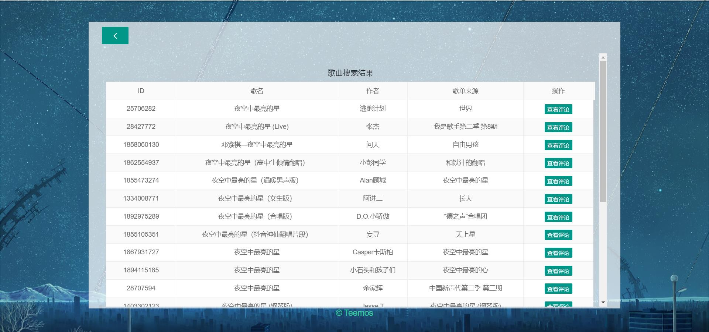
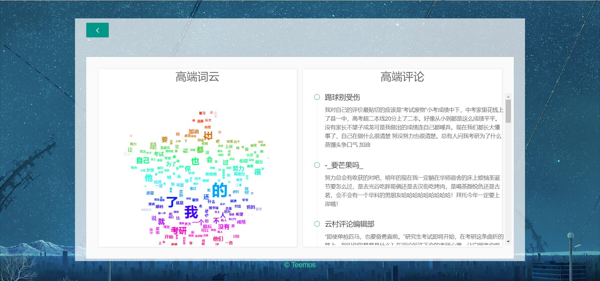

# The-Spider-Of-Music-163
关于网易云音乐评论的爬虫

# 前言

自打开网抑云之后，我久久无法忘记，是它才能带给我内心世界的波涛汹涌。我左手拿起它，右手放下它，一日复一日，我终于完成了《The Spider Of Music-163》这个还勉强让我满意的作品


PS.我也没想到，我这么懒还会去扩展[[实战]爬取网抑云音乐评论](https://blog.csdn.net/weixin_45766049/article/details/120504972)，（摊牌了，其实我把它当作犁牛克斯这门课的大作业）

# 所需环境

开发工具

- HBuilder X
- Pycharm 2019.3


前端所用框架及插件

- Layui
- Swiper
- jQuery


Python使用的相关库：

- 内置库
- flask
- flask_cors
- aip
- pymysql
- pycryptodome
- bs4
- numpy
- pillow
- jieba
- wordcloud

# 项目结构

## 前端结构

`index.html`为网站主页，

`layui`、`jquery.min.js`和`swiper`是前端所需的模块，去对应官网下载后，放着就行，

`css`和`js`为页面所需的样式与脚本代码，

`img`存放图片，`m_song`存放不同功能的子页面

```
.
├── css
│   ├── comments.css
│   └── index.css
│
├── js
│   ├── index.js
│   └── jquery.min.js
│
├── layui
├── swiper
├── img
│
├── m_song
│   ├── comments.html
│   ├── comments_res.html
│   ├── search_res.html
│   └── wordcloud.html
│
└── index.html
```

## 后端结构

- `app.py`为启动flask的核心，也写着对应网站路径的路由

- `utils`存放工具类
- `comments.txt`存储爬取歌曲后的评论，供词云使用
- `MySong.py`为爬虫核心
- `MyWorldcloud.py`生成词云，`teemos.jpg`和`zifu.ttf`为生成词云所需的背景图和微软雅黑字体，`wordcloud.png`为生成后的词云图

```
.
├── app.py
└── utils
    ├── comments.txt
    ├── MySong.py
    ├── MyWordcloud.py
    ├── teemos.jpg
    ├── wordcloud.png
    └── zifu.ttf
```

# 项目原理

本项目是基于[[实战]爬取网抑云音乐评论](https://blog.csdn.net/weixin_45766049/article/details/120504972)的可视化扩展，爬虫原理部分就不赘述了，详见[[实战]爬取网抑云音乐评论](https://blog.csdn.net/weixin_45766049/article/details/120504972)

本项目采用前后端分离的架构，前后端可以分别独立开发，我前端开发使用`HBuilder X`，后端开发使用`Pycharm`，这样也方便后期的维护

由于我比较懒，且项目也比较简单，流程图我就不画了，我简单的口述一下

index.html主页里有三个模块

- 搜索歌曲
- 歌曲搜索结果列表。由一个iframe即search_res.html组成
- 词云与热评。由一个iframe即comments.html组成，而comments.html页面包括wordcloud.html和comments_res.html

这三个模块通过swiper来控制出场顺序，点击相应按钮后才会切换到下一个模块

## 点击按钮

点击搜索按钮：

- index.html向服务器发起ajax请求，请求的数据为搜索的歌曲名
- 服务器根据接收到的数据进行爬虫，并返回歌曲列表json给search_res.html
- index.html使用swiper将页面切换到第二个模块
- search_res.html根据得到的json可视化展示歌曲列表信息

点击查看评论按钮：

- search_res.html页面向后端发起ajax请求，请求的数据为查看评论的歌曲ID
- 服务器根据接收到的数据进行爬虫，保存txt评论信息
- index.html使用swiper将页面切换到第三个模块
- wordcloud.html向服务器发起ajax请求，服务器根据txt制作词云后，返回词云图片
- comments_res.html向服务器发起ajax请求，根据得到的json可视化展示精彩评论

## 总结

个人感觉本项目似乎也没啥技术含量，非要说技术含量就是爬取评论和歌曲名的解密过程。。。并且有的代码写的挺乱的，也不规范，凑合着用吧，懒得改了，有啥建议都可以提哈

# 项目结果图

主页类似百度搜索的界面，输入歌名就行歌曲的搜索


图1 主页

第二个页面，类似在各大音乐平台搜索歌曲的结果



图2 搜索结果

第三个页面，展示所查看歌曲的词云图以及热门评论



图3 词云和评论

# 项目部署

本项目使用前后端分离的架构，因此前端后端需要分别部署

本文以Centos7为例，使用之前需要将前端这三个文件里的出现的IP地址`192.168.160.137`替换为你自己服务器的IP地址

- comments_res.html

- wordcloud.html

- index.js

## 前端部署

前端部署在apache中，启动后，将前端的程序放入`/var/www/html`中，使用IP地址访问即可

```bash
# 安装apache
yum -y install httpd
# 启动Apache
systemctl start httpd
# 设置httpd服务开机启动
systemctl enable httpd
```

## 后端部署

后端所需python3环境，由于系统自带的是python2，因此需要安装python3，安装完python3后，输入`python3`和`pip3`就可以使用python3了

```bash
# 安装依赖包
yum -y groupinstall "Development tools"
yum -y install zlib-devel bzip2-devel openssl-devel ncurses-devel sqlite-devel readline-devel tk-devel gdbm-devel db4-devel libpcap-devel xz-devel

# 去官网下载相关版本的python
wget https://www.python.org/ftp/python/3.8.0/Python-3.8.0.tar.xz

# 解压压缩包并安装
tar -xvJf  Python-3.6.2.tar.xz
cd Python-3.6.2
./configure --prefix=/usr/local/python3
make && make install

# 创建软连接
ln -s /usr/local/python3/bin/python3 /usr/bin/python3
ln -s /usr/local/python3/bin/pip3 /usr/bin/pip3
```

安装本项目所需的python库

```bash
pip3 install flask
pip3 install flask_cors
pip3 install aip
pip3 install pymysql
pip3 install pycryptodome
pip3 install bs4
pip3 install numpy
pip3 install pillow
pip3 install jieba
pip3 install wordcloud
```

觉得速度慢的话可以换清华源，可以使用`-i`参数指定清华镜像

```bash
pip3 install -i https://pypi.tuna.tsinghua.edu.cn/simple XXXXXX
```

可以永久设置镜像源

```bash
pip3 config set global.index-url https://pypi.tuna.tsinghua.edu.cn/simple
```

进入后端文件夹内，输入指令启动运行后端

```bash
python3 app.py
```

如果需要外网访问或虚拟机外访问，则需要关闭Centos7自带的防火墙

```bash
# 停止firewall
systemctl stop firewalld.service
# 禁止firewall开机启动
systemctl disable firewalld.service 
```

至此，项目部署完毕

# 参考文献

[1] 提莫莫 《[实战]爬取网抑云音乐评论》 (https://blog.csdn.net/weixin_45766049/article/details/120504972)

[2] Java后端何哥 《Python文本挖掘：词云图》 (https://blog.csdn.net/CSDN2497242041/article/details/77175112)

[3] 各种百度

[4] 各种B乎

[5] 各种CSDN

